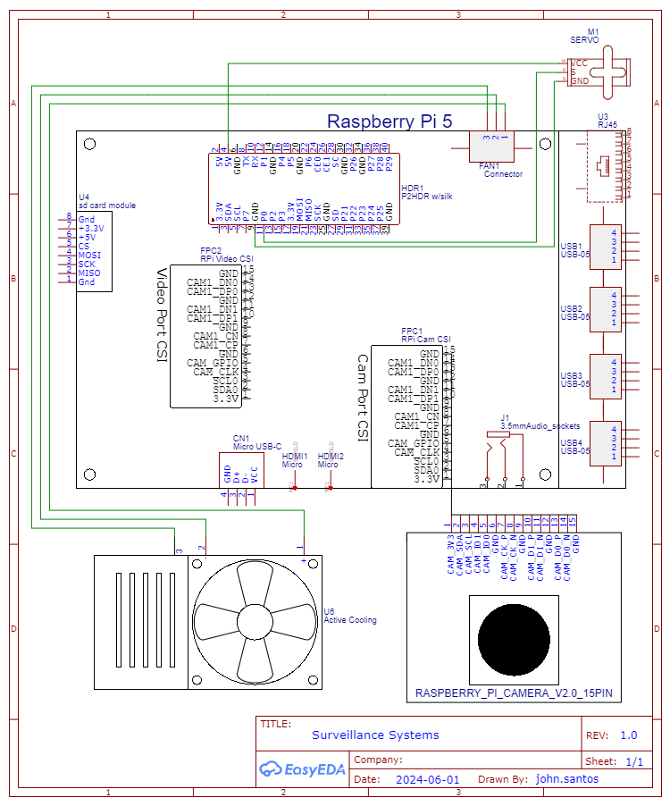

# Surveillance-Systems
This package provides surveillance capabilities with various functionalities 
allowing secure usage, motion notifications, and connectivity from anywhere 
via any device with internet access.


## Overview

- [Changelog](#changelog)
- [Preview](#preview)
- [Hardware Requirements](#hardware-requirements)
- [Installations](#installations)
- [Usage](#usage)
- [Application Public Access](#application-public-access)
- [References](#references)

## Changelog

- TBA: TBA: TBA

## Preview

At first visit, the user is prompted to login to access the camera feed.


Once authorized, the user has access to the live feed from the camera with
various options of control such as rotation of the camera and capturing images
and videos (*In progress*). 


## Hardware Requirements

The electrical schematic for the product is provided below.



This application uses the following hardware:

1. Raspberry Pi 5 with 64-bit Raspberry Pi OS Debian Distro (*Released: 2024-03-15*).
2. Freenove 8MP camera module provided with their [instructions and quickstart guides](https://github.com/Freenove/Freenove_Camera_Module_for_Raspberry_Pi). 
3. Standard servo motor (3-pin) PiGPIO compatible.
4. [Geeekpi Mini Tower Kit](https://www.amazon.ca/GeeekPi-Raspberry-Cooler-Module-Expansion/dp/B0CQYTN94R) for Raspberry Pi 5.

## Installations

Update and upgrade the system

```shell
sudo apt update
sudo apt upgrade
```

It is recommended to start a python virtual environment.

This command includes already installed libraries such as picamera2.
```shell 
python -m venv --system-site-packages <environment path>
```

*Note change <> to the desired location to store the environment.*

Install the application's dependency requirements.

```shell
pip install -r requirements.txt
```

## Usage

The following shell commands are used to run the camera application.

```shell
python -m surveillance -c <path to the config.json>
```

For non-root users `--libcamera-hello` does not detect dma_heap. Other solutions
online such as editing a specific file may not work, so this command is an alternative.

```shell
sudo -E python -m surveillance -c <path to the config.json>
```

*Note: A file called config.json is required which is formatted as follows:*

```json
{
    "sender_email": "email to use to send notifications",  
    "sender_password": "sender email password (generated by google).",
    "receivers": ["email recipients"],
    "secret_key": "secret key",
    "location": "Location of the camera",
    "users": {
        "username": "password"
    }
}
```

If file changes are required, add permission to the file to allow changes to be saved.
```shell
sudo chmod a+rwx <filepath>
```

## Application Public Access

* remote.it

This is one of many solutions for accessing the connection to the Raspberry Pi 
including the locally deployed Flask server from anywhere with internet access
provided by the services in [remote.it](https://www.remote.it/download). 

* Port Forwarding

## References

This application continues the work by `IcyG1045`'s [CM4CAM](https://github.com/IcyG1045/CM4Cam/tree/main).